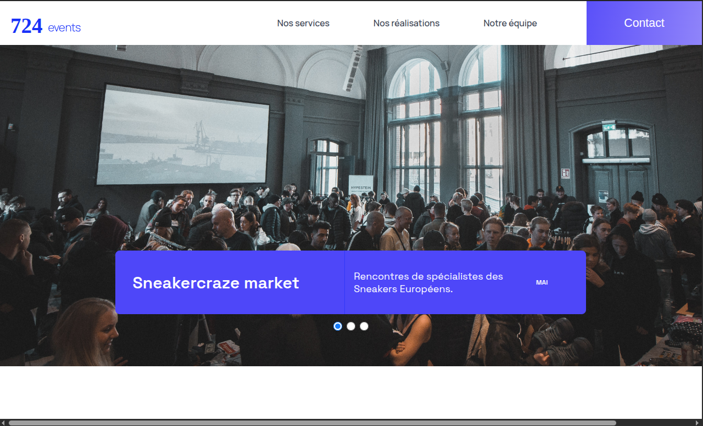

# 724events

## Description

724events est un projet réalisé dans le cadre de la formation Développeur Intégrateur Web d'OpenClassrooms.

L'objectif consistait à reprendre un site événementiel développé avec React afin d'identifier, analyser et corriger les différents bugs présents dans l'application. Le projet incluait également la validation des tests existants ainsi que la rédaction d'un cahier de recette fonctionnel.

## Objectifs

* Identifier les anomalies du site.
* Déboguer une application React existante.
* Corriger les comportements erronés.
* Utiliser les outils de développement React.
* Vérifier la conformité fonctionnelle du site.
* Rédiger un cahier de recette complet.

## Technologies utilisées

* React
* JavaScript
* Jest
* React Testing Library
* React Developer Tools
* Chrome DevTools
* Node.js
* Yarn
* Git
* GitHub

## Fonctionnalités

* Analyse des composants React
* Correction des bugs fonctionnels
* Validation des comportements utilisateurs
* Exécution des tests unitaires
* Exécution des tests d'intégration
* Rédaction de scénarios de recette
* Vérification des parcours utilisateurs

## Compétences développées

* Debug React
* Analyse d'état et de props
* Chrome DevTools
* React Developer Tools
* Tests unitaires
* Tests d'intégration
* Jest
* React Testing Library
* Quality Assurance
* Cahier de recette
* Validation fonctionnelle

## Aperçu

Site événementiel React débogué et stabilisé grâce à l'analyse des composants, la correction des anomalies fonctionnelles et la mise en place d'une démarche qualité basée sur les tests et la recette.

## Lancer le projet

1. Cloner le dépôt.
2. Installer les dépendances avec `yarn install`.
3. Lancer l'application avec `yarn start`.
4. Exécuter les tests avec `yarn test`.

## Auteur

Projet réalisé dans le cadre de la formation OpenClassrooms - Développeur Intégrateur Web.
